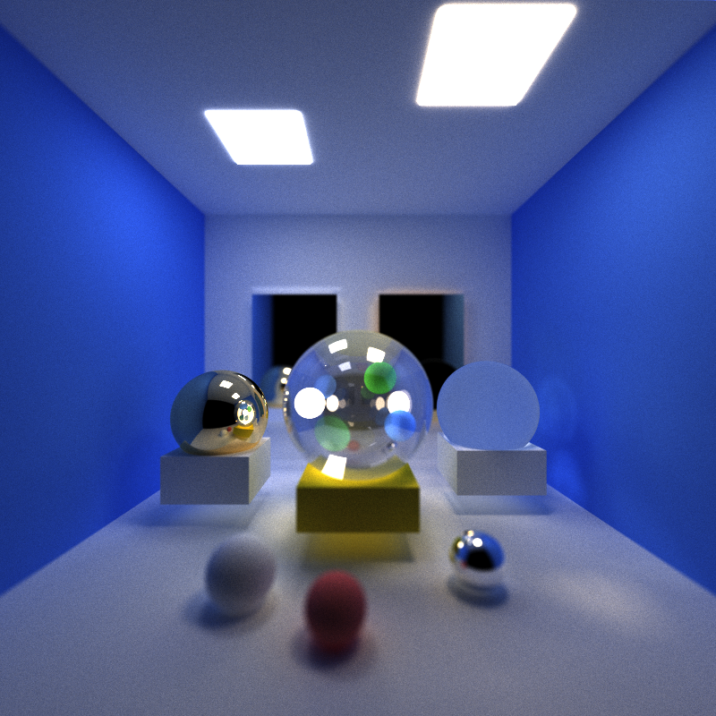
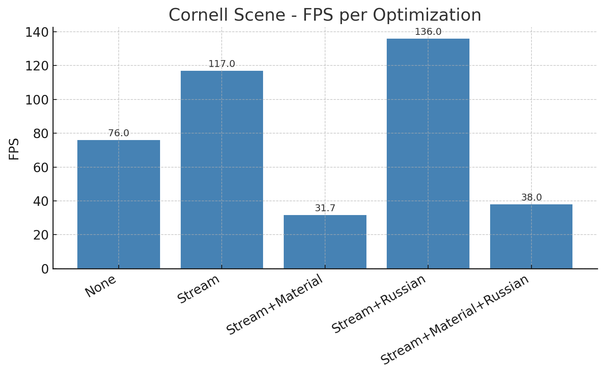
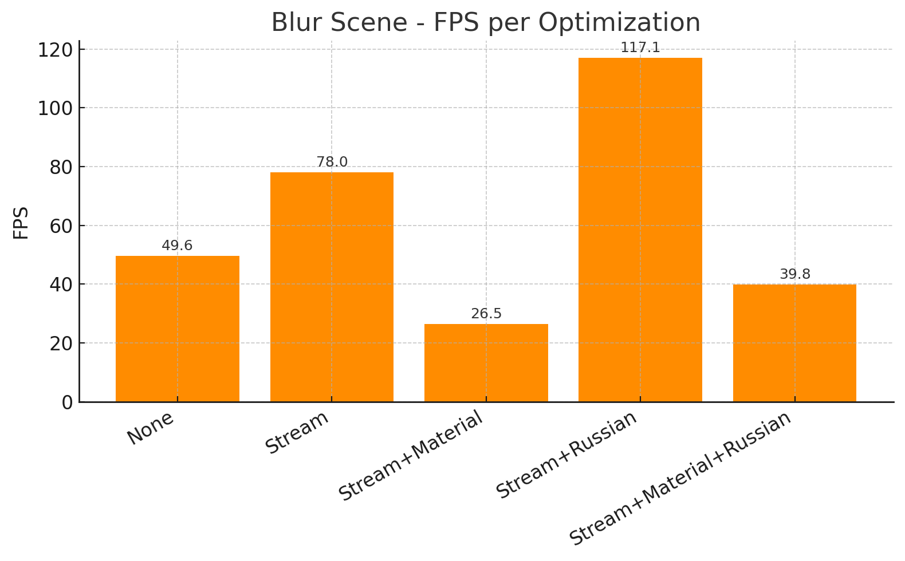
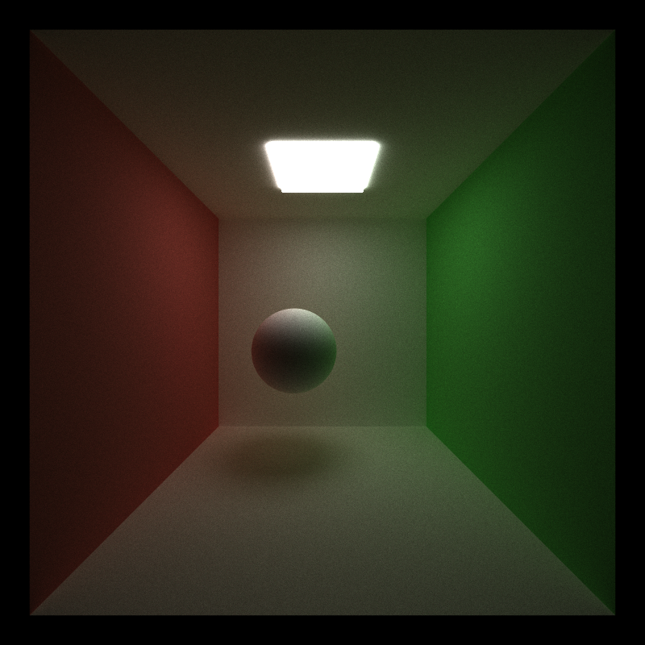
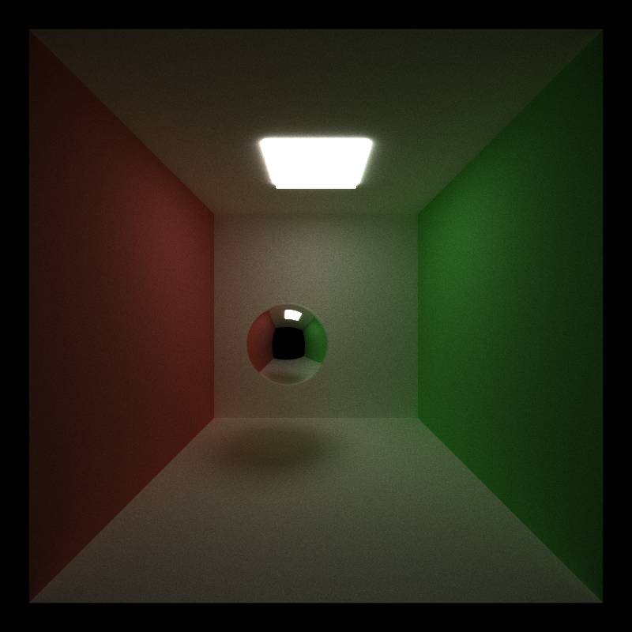
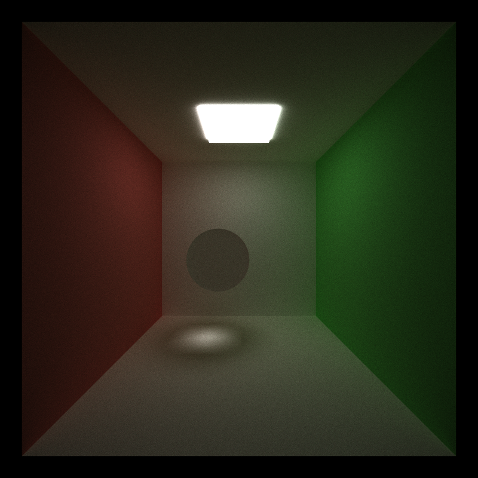
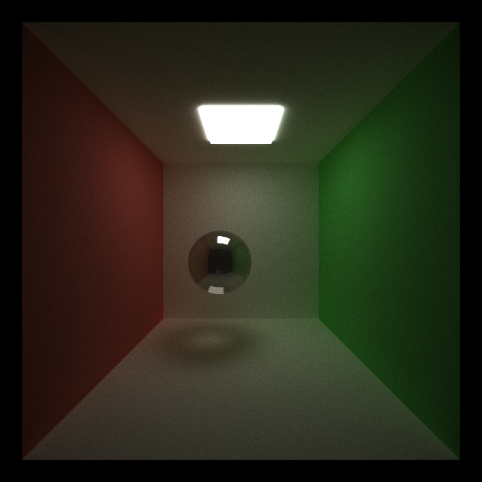
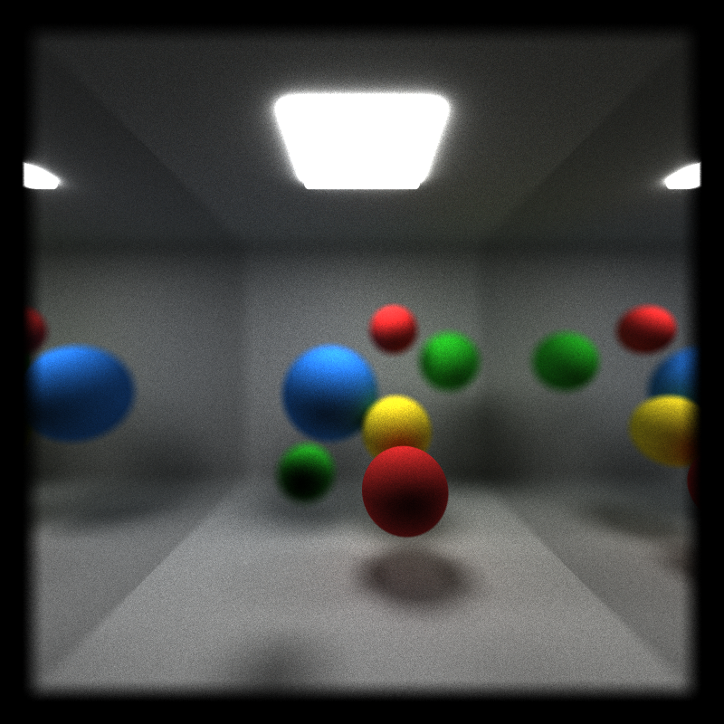
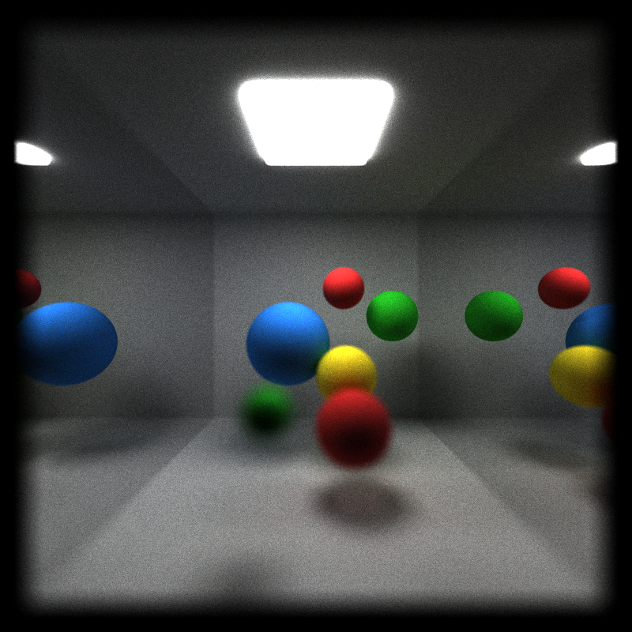

CUDA Path Tracer
================

**University of Pennsylvania, CIS 565: GPU Programming and Architecture, Project 3**

* Cecilia Chen 
  * [LinkedIn](https://www.linkedin.com/in/yue-chen-643182223/)
* Tested on: Windows 11, i7-13700F @ 2.1GHz 16GB, GeForce GTX 4070 12GB (Personal Computer)

---

### Project Overview
A physically-based GPU path tracer written in CUDA with modern performance techniques and a restartable workflow.

**Highlights:**  
* Wave-style execution with **stream compaction** to keep only active paths.  
* **Material sorting** to reduce warp divergence during shading.  
* **Russian roulette** to terminate low-contribution paths without bias.  
* **Depth of Field** (physically-based thin-lens camera model).  
* A small material library: diffuse, **perfect specular, transmissive, and glass**.  
* **Re-startable Path tracing:** checkpoint to save and restore render progress (resume later without losing samples).  

Test Scenes:  
cornell.json -> default scene  
blur.json -> depth of field
crystal_gallary.json -> final effect  

---

### Performance Optimization

#### Stream Compaction
Removes dead paths after each bounce using a boolean mask + Thrust remove_if  
Reduces wasted work and keeps GPU occupancy high.

#### Material Sorting
Sorts pathSegments and intersections by material ID using thrust::sort_by_key so warps shade similar materials together.  
Minimizes warp divergence and improves shading efficiency (when material count is small vs. active rays).

#### Russian Roulette Termination
Starts at bounce depth 3->4. Cuts long, low-contribution light paths while keeping the estimator unbiased.

- Compute continuation probability  
$p = \mathrm{clamp}\!\left(\max(\text{throughput}),\, p_{\min},\, p_{\max}\right)$
- Kill the path with probability $1 - p$;  
  if it survives, scale its throughput by $1/p$.
  if it survives, scale its throughput by \( 1 / p \).

#### Evaluation & Performance Analysis
We benchmarked the path tracer on two representative scenes: Cornell Box (closed scene with many bounces) and a Blur DOF scene (used mainly to test depth of field but also useful for performance trends).
For each scene, we measured frames per second (FPS) under different optimization configurations:

  
  

**Stream compaction** greatly improved performance, raising FPS from 76→117 in Cornell and 49.6→78 in Blur by removing terminated paths and keeping the GPU busy. **Russian roulette** further boosted speed, reaching 136 FPS in Cornell and 117.1 FPS in Blur by terminating low-contribution paths without bias. In contrast, **material sorting** hurt performance, as its sorting overhead outweighed any divergence reduction.  
Overall, the most practical and impactful optimization was the combination of stream compaction and Russian roulette, while material sorting should be applied selectively and only when scenes have many complex materials that cause heavy divergence.

### Features & How They Work
#### Material/BSDF Library
Supports more physically-correct appearances beyond Lambertian surfaces.

* Diffuse: cosine-weighted hemisphere sampling.  
* Perfect Specular: mirror reflection.  
* Refraction: Snell’s law with Fresnel split.  
* Glass: probabilistically reflect or transmit based on Fresnel.

  
  

  
  

#### Depth of Field (Thin-Lens Camera)
Implements a physically-based aperture model:

* Each primary ray is offset on a lens of radius lenRadius.  
* Ray direction refracted toward a focal plane at distance focalDist.
* Objects at the focal distance stay sharp; nearer/farther objects blur naturally.
* blur.json is a test scene with spheres at different depths to visualize this effect.

*The following images are all generated with lens of radius = 0.5.*

<table>
  <tr>
    <td align="center" width="50%">
       
      <em>No Depth of Field</em>
    </td>
    <td align="center" width="50%">
       
      <em>Focal Distance = 7.5f</em>
    </td>
  </tr>
  <tr>
    <td align="center" width="50%">
       
      <em>Focal Distance = 10.5f</em>
    </td>
    <td align="center" width="50%">
       
      <em>Focal Distance = 14.0f</em>
    </td>
  </tr>
</table>

#### Re-startable Path Tracing
Makes long renders user-friendly (stop and continue later).

Save:  
Film accumulation buffer (scene.image).  
Iteration count and camera/scene settings.

Load:  
Restore film and iteration; resume without losing progress.  
Using command-line input: "filename.json --resume checkpoint.ptck"

*Resuming rendering of crystal_gallery.json from iteration 1087.*

